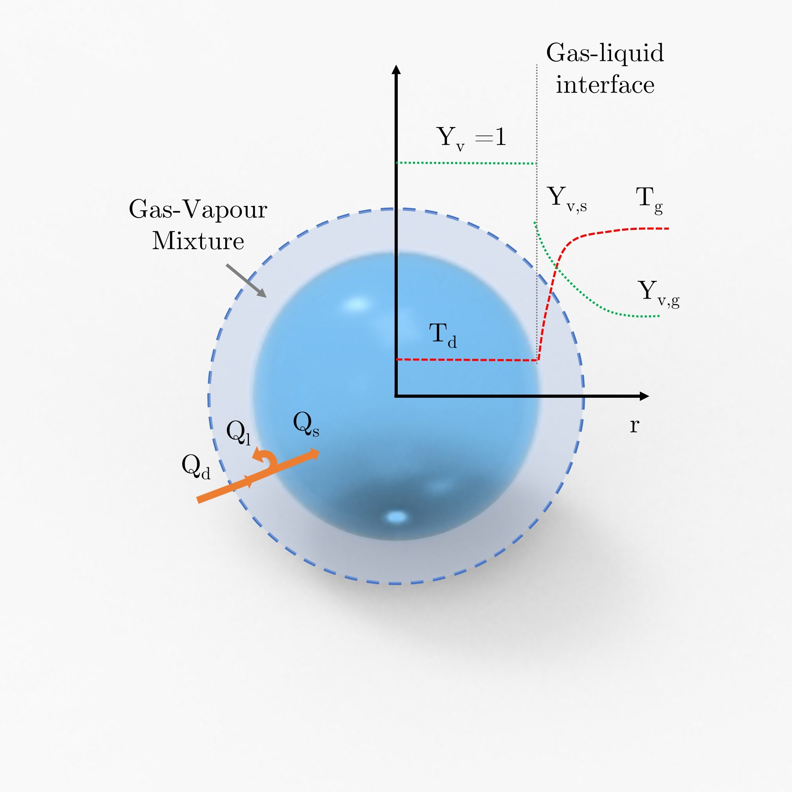

# Droplet Evaporation 0D model
## How to install
You can download the latest version of the repository from the GitHub page and then you can install the package with pip:

```bash
pip install dropletevapmodel
```

## Install editable from source

You can install the package with:

```bash
pip install -e .
```


## How to use it

### Data model 

The model requires input data organized into three main sections: "fluid_properties," "gas_properties," and "simulation_config" Under "fluid_properties," parameters such as density (rho_d), boiling temperature (boiling_t), specific heat capacity (cp_l), molecular mass (mm_d), surface tension (sigma_d), and various coefficients related to heat capacity and thermal conductivity need to be specified. Similarly, the "gas_properties" section requires information on molecular mass (mm_g), surface tension (sigma_g), gas constant (r), speed (speed_g), and coefficients for heat capacity and thermal conductivity.

The "simulation_config" section encompasses various configurations for the simulation. The simulation of droplet evaporation involves several configuration parameters that define the modeling, environmental conditions, initial states, and output preferences. Below is a description of each parameter within the `simulation_config` section:

 1. Modelling Configuration

   - **Timestep (`timestep`):** The time increment used in each iteration of the simulation. It represents the duration between consecutive time steps during the model's execution.

   - **Maximum Iterations (`max_iteration`):** The maximum number of iterations the simulation will run. This parameter controls the overall duration of the simulation.

 2. Environment Configuration

   - **Pressure (`pressure`):** The pressure within the environment, specified in Pascals (Pa). It influences various thermodynamic properties of the system.

   - **Atmospheric Pressure (`pressure_atm`):** The atmospheric pressure in Pascals (Pa) is the pressure exerted by the Earth's atmosphere at sea level.

   - **Boltzmann Constant (`kb`):** The Boltzmann constant, a fundamental constant of nature, used in thermodynamic calculations. It is specified in joules per kelvin (J/K).

   - **Droplet Concentration (`drop_conc`):** The initial concentration of droplets in the environment, typically given in droplets per unit volume.

 3. Initial Conditions (`t_zero`)

   - **Initial Droplet Diameter (`d_zero`):** The initial diameter of the droplet at the start of the simulation, specified in meters (m).

   - **Initial Droplet Temperature (`t_d_zero`):** The initial temperature of the droplet at the beginning of the simulation, specified in Kelvin (K).

   - **Initial Gas Temperature (`t_g_zero`):** The initial temperature of the surrounding gas at the start of the simulation, specified in Kelvin (K).

   - **Initial Water Content in Gas (`water_content_g_zero`):** The initial water content in the gas phase, specified in the form of mass fraction or other suitable units.

 4. Output Configuration

   - **CSV Output (`csv`):** A boolean flag indicating whether to enable CSV output. If set to `true`, the simulation results will be exported to a CSV file.

   - **Plotting Output (`plotting`):** A boolean flag indicating whether to enable plotting of simulation results. If set to `true`, the model will generate plots to visualize key variables and trends.

These configuration parameters collectively define the settings and conditions under which the droplet evaporation simulation will be conducted. Adjusting these parameters allows users to tailor the simulation to their specific scenarios and study the behavior of droplet evaporation under different conditions.

This structured data will be used as input to instantiate the "DropletEvapModel" Pydantic model, ensuring that all necessary parameters are defined and adhere to their respective constraints.

### Use DropletEvapModel

This guide explains how to use the `EvapModel` class for simulating droplet evaporation based on the `DropletEvapModel` Pydantic model. The provided Python code includes a simulation model, constants evaluation, and initialization parameters. Follow the steps below to utilize the `EvapModel` class effectively.

#### Import Necessary Modules

```python
import tqdm
import numpy as np
from typing import Dict

from ._utils import setup_logger
from .models.phy_model import DropletEvapModel
from .phy_utils import layer_temp, sat_pressure_g, vap_pressure_g, eval_omega, eval_diff_coeff, eval_vap_heat, eval_viscosity, eval_m_viscosity, eval_cp, eval_k, eval_phi

```

#### Load your DropletEvapModel instance

```python
model_config = {...}  # Your data
model_instance = DropletEvapModel(**model_config)

evap_model = EvapModel(model=model_instance)
```

#### Run the simulation

```python
evap_model.run()
```

#### Access the results


```python
results = evap_model.run()
final_state = results[max(results.keys())]
```

## Available data
Available data for liquid and gas materials are contained in liq.csv and gas.csv databased that
can be found is configs folder.


## Technical backgroud

The 0-D model used for the simulation of a single droplet evaporation was developed according to a diffusion model based on mass and energy balance well reported in literature [[1]](#1) [[2]](#2), following the classical evaporation model (CEM) proposed by Spalding [[3]](#3) and Godsave [[4]](#4). This model was further improved following Abramzon-Sirignano approach [[5]](#5) [[6]](#6), that enabled a better account for advective mass and energy transport. A detailed description of the governing equations and limitations of this model was recently reviewed by Pinheiro et al. [[7]](#7). Mass and energy balances can be described according to following equations, respectively:

$\frac{{d m_d}}{{dt}} = -\dot{m}_d$

$m_d \cdot c_{p_l} \frac{{dT_d}}{{dt}} = -Q_s$

where $m_d$ is the droplet mass, $\dot{m}_d$ is the mass evaporation rate, $`c_{p_l}`$ is the specific heat capacity of the liquid droplet, $T_d$ is the droplet temperature, and $Q_s$ is the net power transferred from the environment which contributes to droplet temperature increase.

Balance can be rewritten as a function of droplet diameter $D_d$, under the hypothesis of a spherical and homogeneous droplet:

$\frac{{dD_d}}{{dt}} = -\frac{{2 \dot{m}_d}}{{\pi \rho_l D_d^2}} \quad (3)$

According to the CEM model, widely discussed and applied in different fields of research to study droplet evaporation, based on mass and energy balance evaporation flow rate can be described according to the following equation:

$`\dot{m}_d = \pi D_d D_{vm} \rho_m Sh_m \ln(1 + B_M) \quad (4)`$

where $D_v$ is the vapor diffusion coefficient, $\rho$ is the density, $Sh$ is the Sherwood number, and $B_M$ is the Spalding mass transfer number. It’s worth mentioning that all the physical properties were calculated in the region of gas-vapor film, considering the presence of both gas and water vapor species. Moreover, as described below, the temperature effect on the value of physical properties was included.




The Spalding mass transfer number can be calculated using Equation (5):

$B_M = \frac{{Y_{vs} - Y_{vg}}}{{1 - Y_{vs}}} \quad (5)$

where $Y_{vs}$ and $Y_{vg}$ refer to vapor mass fraction at the droplet-gas interface and in the environment away from the droplet surface, respectively. While $Y_{vg}$ can be calculated using the known vapor content in the gas phase far away from the droplet surface, $Y_{vs}$ can be determined applying the classical ideal gas law (Equation (6)) under the assumption of liquid-vapor thermodynamic equilibrium at the droplet interface (Raoult’s and Clausius-Clapeyron’s laws, Equation (7)):

$Y_{vs} = \frac{{\chi_{vs} W_v}}{{\chi_{vs} W_v + \chi_{gs} W_g}} \quad (6)$

$\chi_{vs}^{eq} = \frac{{p_{sat}}}{{p_g}} = \frac{{p_{atm}}}{{p_g}} \exp\left(\frac{{L_v M_v}}{{R}} \left(\frac{1}{{T_b}} - \frac{1}{{T_d}}\right)\right) \quad (7)$

where $\chi_{vs}$ and $\chi_{gs}$ are respectively the surface vapor and gas mass fraction of the liquid-gas mixture, $M_v$ is the vapor molar mass fraction, $W_g$ is the gas molar mass, $L_v$ is the enthalpy of vaporization of the liquid droplet, $p_g$ is the gas pressure, $R$ is the gas constant, and $T_b$ is the liquid boiling temperature at standard condition.

Sherwood number ($Sh$) accounts for the increase of mass transfer due to gas motion and droplet slip velocity through Reynolds ($Re$) and Schmidt ($Sc$) numbers. According to Ranz-Marshall empirical correlation [[8]](#8), $Sh$ number can be evaluated using Equation (8):

$Sh_m = 2 + Re_d^{1/2} Sc_m^{1/3} \quad (8)$

where

$Re_d = \frac{{\rho_g D_d |u_g - u_d|}}{{\mu_m}} \quad (9)$

$Sc_m = \frac{{\mu_m}}{{\rho_m D_{vm}}} \quad (10)$

and $\rho_g$ is the gas density, $u_g$ and $u_d$ are the gas and droplet velocity respectively, and $\mu_m$ is the dynamic viscosity calculated for the gas-vapor mix.

The mass and energy transfer between gas and droplets at the interface is usually taken into account using a correction factor $G$, as discussed by El Wakil et al [[9]](#9). Concerning the energy balance, already reported in Equation (2), it should be mentioned that only part ($Q_s$) of the total energy received from the environment ($Q_d$) contributes to the droplet temperature increase. Indeed, part of the energy contributes to the evaporation of the liquid ($Q_l$), limiting the droplet temperature increase. Following what is reported in [[7]](#7), the energy balance can be rewritten as a function of gas temperature ($T_g$) as follows:

$Q_s = Q_d - Q_l = G\pi D_d Nu_m k_m (T_g - T_d) - L_v \dot{m}_d \quad (11)$

Where Nusselt number ($Nu$) can be calculated using Prandtl number ($Pr$) instead of Sc number in Equation (8), using the specific heat capacity ($c_{p_m}$) and the thermal conductivity ($k_m$) of the gas-vapor mixture:

$Pr_m = \frac{{\mu_m c_{p_m}}}{{k_m}} \quad (12)$

The correction factor $G$ can be expressed as a function of a non-dimensional evaporation parameter $\beta$:

$G = \frac{\beta}{{e^\beta - 1}} \quad (13)$

$`\beta = -\frac{\dot{m}_d c_{p_m}}{2\pi k_m D_d} \quad (14)`$

As detailed in several publications by Abramzon and Sirignano [[5]](#5) [[6]](#6), a more realistic approach can be used taking more precisely into account mass and energy transport. In this perspective, modification to the CEM model was carried out using two different correction factors ($F_M$ and $F_T$), based on the film theory considering the effect of Stefan’s flows at the liquid-gas interface.

$F_M = \left(1 + B_M\right)^{0.7} \frac{\ln(1 + B_M)}{B_M} \quad (15)$

$F_T = \left(1 + B_T\right)^{0.7} \frac{\ln(1 + B_T)}{B_T} \quad (16)$

Where $B_T$ is the Spalding thermal energy transfer number calculated according to the following equations:

$B_T = \left(1 + B_M\right)^\phi \quad (17)$

$\phi = \frac{c_{p_v}/c_{p_g} \cdot Sh/Nu \cdot 1/\text{Le}_m} \quad (18)$

$`\text{Le}_m = \frac{{k_m}}{{c_{p_m} D_{vm} \rho_m}} \quad (19)`$

where $\text{Le}$ is Lewis number. The corrected value of $G$, $Sh^*$ and $Nu^*$ numbers that should be employed in Abramzon-Sirignano model are reported in the following equations:

$Sh^* = 2 + \frac{{Sh_0 - 2}}{{F_M}} \quad (20)$

$Nu^* = 2 + \frac{{Nu_0 - 2}}{{F_T}} \quad (21)$

$G^* = \frac{\ln(1 + B_T)}{B_T} \quad (22)$

## Gas, Vapor, and Liquid Properties

As mentioned above, the physical properties of the gas, liquid, and gas-vapor mixtures and their temperature dependence were calculated using different approaches reported in the published literature.

In the droplet proximity, gas-vapor properties can be described according to the film theory. A brief schematic representation of the droplet-gas environment and the “film region” is reported in Figure 4.3, where $T$ is the temperature and $Y$ is the vapor mass fraction. As reported by Hubbard et al. [[10]](#10) and Yuen and Chen [[11]](#11), temperature and other physical properties can be approximated using an averaging procedure (Equation (23)), where the weighting coefficient ($\alpha$) is 1/3 [[7]](#7).

$T_m = T_s + \alpha (T_g - T_s) \quad (23)$

Vapor diffusion coefficient ($D_{vm}, \, \text{cm}^2/\text{s}$) were calculated following the approach reported by Cussler [[12]](#12) and proposed by Chapman and Enskog:

$`D_{vm} = \frac{{1.86 \times 10^{-3} T_m^{3/2} \left(\frac{1}{M_{Ar}} + \frac{1}{M_v}\right)}}{{p \times \sigma_{12} \times \Omega}} \quad (24)`$

where $p$ is the process pressure in atm, $\sigma_{12}$ is the collisional diameter in Å, while $\Omega$ is a dimensionless factor that can be described according Lennard–Jones 12-6 potential. The temperature dependence of all these factors was taken into account by fitting the data reported in [[12]](#12) (Table 5.1-2, 5.1-3) for different temperature values.

The fitting of experimental data on liquid enthalpy of vaporization ($L_v$) was used to calculate its dependence with respect to the droplet temperature ($T_d$). While gas density was calculated using the hypothesis of an ideal gas, dynamic viscosity ($\mu_m$) and gas thermal conductivity ($k_m$) at the film interface were obtained applying Wilke equation and Chapman-Enskog model [[13]](#13) to pure gas values obtained from NIST database [[14]](#14). Likewise, the specific heat capacity ($C_{pm}$) of gas mixture was calculated through an average weighted on the value of the single gas component obtained from NIST database [[15]](#15) [[16]](#16).

## Variation of Environment Vapor Content

As a consequence of the droplet evaporation, the water vapor content of the environment increases during droplet shrinking. Since the model was developed to study droplet evaporation in a close-not infinite environment (because of the plasma source relatively low volume dimension with respect to droplet diameter), an increase of vapor content affects the driving force of liquid evaporation (mass concentration gradients) and should be considered.

In this perspective, droplet concentration can be obtained using scanning mobility particle sizer (SMPS) data under the hypothesis of one droplet-one particle conversion, as widely discussed in literature [[17]](#17) [[18]](#18) [[19]](#19). Under the assumption that droplets are equally distributed in the space, each droplet can be considered at the center of a control volume whose dimension is the reciprocal of particle concentration. Following this hypothesis, the hypothetical control volume in which each droplet is contained is much larger than the droplet volume: for a droplet density of $10^5 \, \text{cm}^3$, each droplet is enclosed in a control volume of $10^6 \, \mu \text{m}^3$. If the particle size distribution is small enough (1-5 μm or below), the relative contribution of the droplet volume to the available gas volume can be neglected (for a 5 μm droplet, the ratio between liquid volume and control volume is 0.01 %).

Under the hypothesis, the gas mass for each volume unit ($mass_{Ar}$) can be calculated using the gas ideal law. For each time step of the simulation ($\Delta t$), water content ($\text{ppm}_i$) was updated considering the initial vapor concentration ($\text{ppm}_0$) and the mass evaporated from the droplet ($m_d$), as reported in Equation (25).

$`\text{ppm}_1 = \frac{{\text{ppm}_0 \cdot mass_{Ar} + m_d \cdot 10^6 \cdot \Delta t}}{{mass_{Ar}}} \quad \text{for } i=1 \ldots n  \quad (25) `$

## Assumptions and Limitation of the Simulative Model


It's important to note that the model presented here is characterized by certain assumptions and limitations. According to the literature, these factors may marginally affect the obtained results. However, since the model's output will be compared to experimental results, it's essential to highlight the main hypotheses on which the model is based.

## Gas Temperature Assumption
Firstly, the gas temperature during evaporation and droplet transport inside the control volume (e.g. reactor) is assumed to be constant. This assumption is valid if the heating up of the gas is fast inside the reactor, and the droplet temperature reaches a constant value within a time period much lower than the evaporation time. This way, possible effects of localized streamers and inhomogeneities in the temperature field are not taken into account. Gas temperature was estimated using different techniques described in the previous paragraphs.

## Heat Transfer Resistance
According to literature, the heat transfer resistance inside an evaporating droplet is usually assumed to be negligible. To support this point, we compare the heat transfer resistance inside and outside the evaporating droplet using the Biot number ($Bi$). $Bi$ is a dimensionless number described as the ratio between the heat transfer inside the droplet and at the droplet surface. If $Bi$ < 1, then the internal body thermal resistance can be neglected, and the temperature field can be considered uniform. $Bi$ can be defined according to following equation and expressed as a function of $Nu$, introduced above:


$\text{Bi} = \frac{L_0 \cdot h}{k_l} = \frac{\text{Nu}_m \cdot k_m}{k_l} \quad (26)$


where $ L_0 $ is the characteristic length (r/3 for a sphere), $ h $ is the film heat transfer coefficient (W/m²K), and $ k_l $ is the thermal conductivity of the droplet. Even if all terms are temperature-dependent, the value of the Bi number is slightly affected by small thermal gradients. Indeed, at 293 K, the $Bi$ number for the tested condition is 0.066, significantly lower than 1. This result, in line with what has been already reported in literature [[9]](#9), outlines that the temperature gradient is much higher in the film region than in the droplet bulk, confirming that we can describe the droplet as a solid sphere with infinite thermal conductance.

A comprehensive discussion of a possible application of the model can be found in T. Gallingani 2020  [[20]](#20)

# References

<a id="1">[1]</a>
Lefebvre A H and McDonell V G 2017 Atomization and sprays (CRC press)

<a id="2">[2]</a>
Zhifu Z, Guoxiang W, Bin C, Liejin G and Yueshe W 2013 Evaluation of Evaporation Models for Single Moving Droplet with a High Evaporation Rate Powder Technol. 240 95–102

<a id="3">[3]</a>
Spalding D B 1953 The combustion of liquid fuels Symposium (International) on Combustion vol 4 pp 847–64

<a id="4">[4]</a>
Godsave G 1953 Studies of the combustion of drops in a fuel spray—the burning of single drops of fuel Symposium (International) on Combustion vol 818 pp 818–30

<a id="5">[5]</a>
Abramzon B and Sirignano W A 1989 Droplet vaporization model for spray combustion calculations 32 1605–18

<a id="6">[6]</a>
Sirignano W A 1999 Fluid Dynamics and Transport of Droplets and Sprays (Cambridge University Press)

<a id="7">[7]</a>
Pinheiro A P and Vedovoto J M 2019 Evaluation of Droplet Evaporation Models and the Incorporation of Natural Convection Effects Flow, Turbul. Combust. 102 537–58

<a id="8">[8]</a>
Ranz W E, Marshall W R and Myers P 1952 Evaporation from drops Chem. eng. prog 48 141–6

<a id="9">[9]</a>
El Wakil M M, Uyehara O A and Myers P S 1954 A theoretical investigation of the heating-up period of injected fuel droplets vaporizing in air

<a id="10">[10]</a>
Hubbard G L, Denny V E and Mills A F 1975 Droplet evaporation: effects of transients and variable properties Int. J. Heat Mass Transf. 18 1003–8

<a id="11">[11]</a>
Yuen M C and Chen L W 1976 On drag of evaporating liquid droplets (Taylor & Francis)

<a id="12">[12]</a>
Cussler E L and Cussler E L 2009 Diffusion: mass transfer in fluid systems (Cambridge university press)

<a id="13">[13]</a>
Wilke C R 1972 A Viscosity Equation for Gas Mixtures 517 6–9

<a id="14">[14]</a>
Huber M L and Harvey A H 2011 Tables of recommended values for the viscosity and thermal conductivity of common gases as a function of temperature ed CRC-Press

<a id="15">[15]</a>
NIST Water - Gas phase thermochemistry data

<a id="16">[16]</a>
NIST Argon - Gas phase thermochemistry data

<a id="17">[17]</a>
Stabile L, Trassierra C V, Agli G D and Buonanno G 2013 Ultrafine Particle Generation through Atomization Technique : The Influence of the Solution 1667–77

<a id="18">[18]</a>
Chen T M and Chein H M 2017 Generation and Evaluation of Mono

<a id="19">[19]</a>
Hinds W C 1999 Aerosol technology: properties, behavior, and measurement of airborne particles (John Wiley & Sons)

<a id="20">[20]</a>
Gallingani T 2020 (Alma Mater Studiorum)